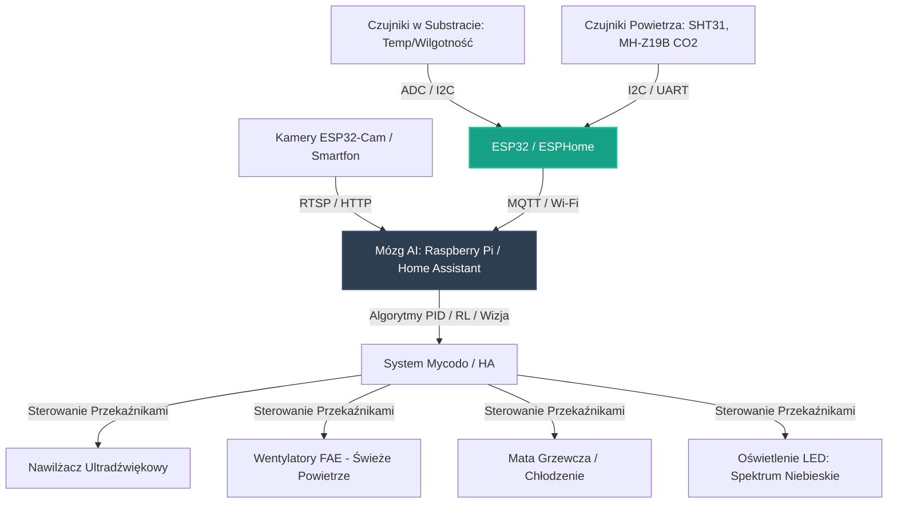

# 24. Automatyzacja Hodowli Grzybów (Mycodo / MycoClimate)

## **Intelekt wyprzedza Kapitał!**

## Opis Projektu
Projekt zakłada wykorzystanie technologii IoT, tanich minikomputerów (Raspberry Pi), mikrokontrolerów (ESP32/Arduino) oraz sztucznej inteligencji (Edge AI / Computer Vision) do budowy w pełni autonomicznych, niskokosztowych komór hodowlanych dla grzybów jadalnych i leczniczych. System automatycznie zarządza mikroklimatem, a modele AI optymalizują parametry owocnikowania oraz wykrywają wczesne infekcje (np. zieloną pleśń *Trichoderma*). 

Projekt skupia się na trzech gatunkach o różnym stopniu trudności uprawy:
1. **Pieczarka dwuzarodnikowa (*Agaricus bisporus*):** Klasyk rynkowy o bardzo precyzyjnych i zmiennych wymaganiach CO₂ oraz wilgotności na różnych etapach (szok termiczny, owocnikowanie).
2. **Boczniak ostrygowaty (*Pleurotus ostreatus*):** Szybko rosnący grzyb o ogromnym zapotrzebowaniu na świeże powietrze (wymaga częstej wymiany powietrza - FAE), doskonały do szybkich cykli produkcyjnych w społeczności.
3. **Żółciak siarkowy (*Laetiporus sulphureus* - Chicken of the woods):** Gatunek niezwykle ceniony kulinarnie, ale uważany za **bardzo trudny i eksperymentalny** w hodowli domowej. Wymaga specyficznych substratów drzewnych, stabilnej, wysokiej wilgotności oraz unikalnych, trudnych do wywołania bodźców klimatycznych (np. precyzyjny szok temperaturowo-świetlny). AI jest kluczem do zdekodowania i replikacji tych warunków na bazie ciągłej analizy sensorycznej.

---

## Rola Sztucznej Inteligencji (AI) w Hodowli

Zastosowanie inteligentnych algorytmów na krawędzi (Edge AI) rozwiązuje kluczowe problemy tradycyjnej uprawy grzybów:

*   **Sterowanie Adaptacyjne (PID + RL):** Zamiast prostych reguł "włącz/wyłącz", AI analizuje dynamikę bezwładności termicznej i wilgotnościowej komory. Uczenie ze wzmocnieniem (Reinforcement Learning) uczy się optymalnego dawkowania mgły ultradźwiękowej i wentylacji, zapobiegając skraplaniu wody na kapeluszach grzybów (co prowadzi do gnicia).
*   **Detekcja Kontaminacji (Computer Vision):** Analiza obrazu z tanich kamer (np. ESP32-Cam lub stary smartfon) pozwala na ciągły monitoring substratu. Model klasyfikacji obrazu potrafi wykryć najmniejsze zarodki szkodliwej pleśni (*Trichoderma*, *Aspergillus*) lub infekcji bakteryjnych, zanim rozprzestrzenią się na całą komorę, i automatycznie odciąć zainfekowany blok lub zaalarmować hodowcę.
*   **Optymalizacja Bodźców Owocnikowania:** Przejście grzybni z fazy wegetatywnej (kolonizacja substratu) do generatywnej (owocnikowanie) wymaga tzw. "szoku". AI precyzyjnie koordynuje spadek temperatury, obniżenie stężenia CO₂ (poprzez intensywną wymianę powietrza) oraz cykle świetlne, dopasowując je do tempa wzrostu grzybni wykrytego wizualnie.

---

## Architektura Systemu

Poniższy schemat przedstawia architekturę systemu, w którym tanie czujniki i mikrokontrolery sterowane są przez centralny mózg (Raspberry Pi / stary smartfon), zasilany modelami AI.

---

## Kluczowe Zmienne Środowiskowe

| Gatunek Grzyba | Faza Kolonizacji (Substrat) | Faza Owocnikowania | Zapotrzebowanie FAE (Wymiana Powietrza) | Rola AI |
| :--- | :--- | :--- | :--- | :--- |
| **Pieczarka** | Temp: 24-25°C, Wilgotność: 90-95%, CO₂: >5000 ppm | Temp: 16-18°C, Wilgotność: 85-90%, CO₂: <1000 ppm | Średnie | Precyzyjne obniżanie temperatury i dwutlenku węgla w celu wywołania równego "rzutu" owocników. |
| **Boczniak** | Temp: 24°C, Wilgotność: 85-90%, CO₂: >3000 ppm | Temp: 10-15°C (zależy od odmiany), Wilgotność: 80-85%, CO₂: <800 ppm | **Bardzo wysokie** (brak świeżego powietrza powoduje długie trzony i małe kapelusze) | Automatyczne balansowanie wilgotności przy bardzo częstym wietrzeniu (dynamiczny PID wentylatora i nawilżacza). |
| **Żółciak Siarkowy** | Temp: 20-22°C, Wilgotność: 70-80%, CO₂: >4000 ppm (wysokie) | Temp: 15-18°C, Wilgotność: 90-95% (bardzo stabilna), CO₂: <1200 ppm | Wysokie (wymaga świeżego powietrza bez utraty wilgotności) | **Eksperymentalne modelowanie klimatu:** Detekcja primordiów (zawiązków) za pomocą wizji komputerowej i dopasowanie pod nie mikroklimatu 24/7. |

---

## Zaimportowane i Analizowane Repozytoria (Open Source)

Wdrażamy i adaptujemy najbardziej zaawansowane projekty z zakresu automatyzacji mykologicznej, które stanowią fundament merytoryczny i technologiczny dla Straży Przyszłości:

1.  **[Mycodo Environmental Regulation System](https://github.com/kizniche/Mycodo):**
    *   *Opis:* Najbardziej zaawansowany i dojrzały open-source'owy system kontroli środowiskowej na świecie, zoptymalizowany pod Raspberry Pi.
    *   *Zastosowanie:* Używamy go jako głównego silnika logicznego. Obsługuje wejścia z setek czujników (I2C, SPI, 1-Wire), wyjścia przekaźnikowe, wbudowane sterowniki PID, wykresy w czasie rzeczywistym oraz elastyczny system skryptów w Pythonie.
2.  **[MycoClimate](https://github.com/savvatsekmes/MycoClimate_Git):**
    *   *Opis:* Projekt DIY dedykowany dla entuzjastów domowej uprawy grzybów, zawierający kod dla platformy Arduino, schematy połączeń oraz pliki CAD 3D do druku obudów czujników.
    *   *Zastosowanie:* Wzór do budowy fizycznych komór fruitingowych typu "Martha" o minimalnym budżecie.
3.  **[AgroPi](https://github.com/krogk/AgroPi):**
    *   *Opis:* Modularny system monitoringu i aktuacji oparty na Raspberry Pi z wbudowanym interfejsem webowym i możliwością integracji kamer do tworzenia time-lapse'ów wzrostu.
    *   *Zastosowanie:* Moduł wizualnej dokumentacji wzrostu i gromadzenia danych dla modeli machine learning.
4.  **[Open Mushroom Micro Farm](https://github.com/the-shroom/the-shroom):**
    *   *Opis:* Kompletny zestaw schematów elektronicznych, kodu dla mikrokontrolerów oraz plików projektowych CAD dla małych, zautomatyzowanych farm kontenerowych.
    *   *Zastosowanie:* Skalowanie projektu z małych namiotów domowych do większych, społecznościowych modułów produkcyjnych.
5.  **[Martha Automation Setup](https://github.com/jmhobbs/martha):**
    *   *Opis:* Prosty, dedykowany system automatyzacji namiotów foliowych (fruiting chambers) zintegrowany z Raspberry Pi, ułatwiający konfigurację początkującym hodowcom.

---

## Korzyści dla Inicjatywy Straży Przyszłości
*   **Suwerenność Żywnościowa:** Grzyby to najszybsze i najbardziej wydajne źródło pełnowartościowego białka i witamin, które można produkować przez cały rok w piwnicy, garażu czy szafie z wykorzystaniem odpadów rolniczych (słoma, trociny, fusy po kawie).
*   **Niski Koszt (Upcykling):** Do sterowania możemy wykorzystać stare, nieużywane smartfony (zgodnie z [Projektem 06](06_smartfony_jako_sterowniki.md)), a jako komory hodowlane — stare lodówki, uszkodzone zamrażarki skrzyniowe lub proste plastikowe pudła.
*   **Wymiana Wiedzy:** Opracowanie precyzyjnych profili hodowli dla trudnych grzybów (żółciak siarkowy) i udostępnienie ich jako otwartych receptur klimatycznych (JSON/YAML) to bezcenny wkład intelektualny, realizujący naszą misję: *Intelekt wyprzedza Kapitał!*

---

### Zasoby techniczne:
- **Repozytorium Mycodo:** [https://github.com/kizniche/Mycodo](https://github.com/kizniche/Mycodo)
- **Repozytorium MycoClimate:** [https://github.com/savvatsekmes/MycoClimate_Git](https://github.com/savvatsekmes/MycoClimate_Git)
- **[00. Fundamenty Technologiczne NSIP](00_fundamenty_technologiczne.md):** Protokół MQTT, integracje Home Assistant i ESPHome jako warstwa transmisyjna dla komór grzybowych.
- **[06. Smartfony jako Sterowniki](06_smartfony_jako_sterowniki.md):** Wykorzystanie starych telefonów jako kamer inspekcyjnych AI oraz lokalnych serwerów bazy danych upraw.
- **[23. Katalog części STEP (step.parts)](23_katalog_czesci_step_open_source.md):** Modele 3D wentylatorów, dysz nawilżaczy i mocowań czujników do druku 3D i montażu.

---
*Intelekt wyprzedza Kapitał!*

**Nawet kod już jest, brakuje tylko Ciebie.**
