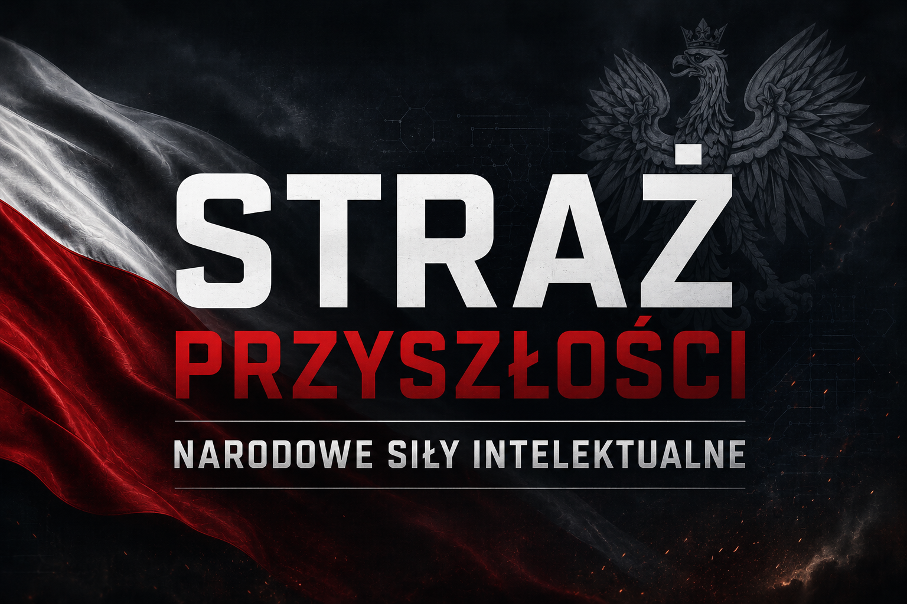

# NARODOWE SIŁY INTELEKTUALNE POLSKI

## **Intelekt wyprzedza Kapitał!**

Zapraszam wszystkich Polskich inteligentów do udziału w NARODOWYM WYSIŁKU INTELEKTUALNYM.

To repozytorium jest częścią inicjatywy budowy NARODOWYCH SIŁ INTELEKTUALNYCH, które ma na celu zebrać wszystkich Inteligentów Polskich w jednym miejscu, by wspólnie stworzyć NARODOWE CENTRUM WYKORZYSTANIA Ai. 

Naszym celem jest zbudowanie AUTOMATYCZNEGO SYSTEMU PRODUKCJI DÓBR I ŻYWNOŚCI przy pomocy Ai, który będzie realnie pracować i produkować na rzecz Dochodu Gwarantowanego – na rzecz WSPÓLNEGO DOBRA NARODOWEGO .

Inicjatywa ma charakter całkowicie oddolny: nie jest zależna od żadnych struktur rządowych, ani od żadnych konkurencyjnych firm zewnętrznych. Kluczowe jest tutaj pełne zaangażowanie intelektualne i współpraca ponad podziałami.

## Główne osie rozwoju i obszary działań AI
Aby realnie odpowiedzieć na najpilniejsze problemy gospodarcze i społeczne, nasza uwaga i moc obliczeniowa będą początkowo skupione na najważniejszych systemach podtrzymujących państwo:
1. **Żywność:** Automatyzacja, robotyzacja i optymalizacja produkcji rolno-spożywczej (np. inteligentna produkcja i dystrybucja, która obniża koszty wyżywienia społeczeństwa).
   *   *Inspiracje:* [Inteligentna Akwakultura](PROJEKTY/01_inteligentna_akwakultura.md), [Wirtualne Ogrodzenia](PROJEKTY/02_wirtualne_ogrodzenia.md), [Monitoring Porodów z Edge AI](PROJEKTY/03_ai_monitoring_porodow.md).
2. **Medycyna:** Zastosowanie AI w diagnostyce, telemedycynie, wynajdywaniu terapii oraz w logistyce ochrony zdrowia, podnosząc skuteczność i dostępność dla każdego obywatela.
3. **Energia:** Opracowanie systemów planowania, magazynowania i dystrybucji zielonej oraz konwencjonalnej energii, by zminimalizować jej straty i zoptymalizować gospodarkę sieciową.
   *   *Inspiracje:* [Laserowy Recykling Paneli PV](PROJEKTY/05_recykling_pv_laserem.md).
4. **Optymalizacja zużycia zasobów strategicznych:** Racjonalne, poparte zaawansowaną analizą danych, zarządzanie wodą, surowcami i ziemią, eliminujące gospodarkę rabunkową.
   *   *Inspiracje:* [Laserowy Recykling Paneli PV](PROJEKTY/05_recykling_pv_laserem.md), [Upcykling LED TV](PROJEKTY/04_lampa_z_recyklingu_tv.md), [Smartfony jako Sterowniki](PROJEKTY/06_smartfony_jako_sterowniki.md).
5. **Logistyka i transport:** Wykorzystanie AI do inteligentnego zarządzania łańcuchami dostaw, trasami przesyłowymi i komunikacją zbiorową w celu minimalizacji czasu, kosztów i śladu węglowego.
   *   *Inspiracje:* [Smartfony jako Sterowniki Edge Computing](PROJEKTY/06_smartfony_jako_sterowniki.md).
6. **Finanse (Fundusze):** Pozyskiwanie środków strategicznych, inteligentny wybór programów grantowych i inwestycji dla nowo powstających projektów.

System ten ma służyć jako potężne wsparcie dla tradycyjnej gospodarki państwowej, w całości się z nią przeplatając i wspomagając jej procesy, jednak w taki sposób, aby nie generować dla niej niepotrzebnej konkurencji. Naszym celem jest synergia, a nie rywalizacja.

## Dlaczego powstał ten projekt? (Nasza motywacja)

Głównym powodem powstania **NARODOWYCH SIŁ INTELEKTUALNYCH** jest zagrożenie wynikające z rozproszenia i czysto komercyjnego wykorzystania sztucznej inteligencji. 

Jeżeli każdy inteligentny i przedsiębiorczy człowiek zacznie indywidualnie i na własną rękę budować małe, prywatne biznesy wspierane przez AI, to za niedługi czas internet stanie się jednym wielkim chaosem. Powstaną miliony instancji sztucznej inteligencji, z których każda będzie działać w zamknięciu, na rzecz indywidualnego zysku swojej jednostki. Zamiast rozwiązywać wielkie bolączki ludzkości i państwa, ogromny potencjał AI oraz gigantyczne ilości energii będą **marnotrawione wyłącznie na wzajemną, bezcelową konkurencję**.

Jeśli chcemy konstruktywnie i mądrze wykorzystać tę potężną siłę, automatyzację i sztuczną inteligencję, musimy **wspólnie zaplanować i wdrożyć procesy, które zadziałają z korzyścią dla ogółu społeczeństwa**. Właśnie po to gromadzimy się w jednej inicjatywie – by nie rozpraszać potencjału na rywalizację rynkową maszyn, lecz połączyć siły i wygospodarować realne zasoby na WSPÓLNE DOBRO.

**Nasza szansa historyczna:** Potencjał generatywnej sztucznej inteligencji sam z siebie jest potężny, ale połączony ze zjednoczonym ludzkim intelektem tworzy siłę bez precedensu. Obecnie w globalnym wyścigu inne państwa i kraje skupiają się głównie na budowaniu coraz potężniejszych modeli (LLM) lub wyścigu o moc obliczeniową (hardware). **Polska może osiągnąć pozycję globalnego lidera nie przez budowę modelu, ale przez jego *inteligentne i celowe wykorzystanie***. Jeśli skonsolidujemy nasz zasób – intelekt polskich specjalistów – do wspólnego, zoptymalizowanego projektowania i produkcji dóbr (skalowalnej automatyzacji), mamy szansę odnieść gigantyczny sukces gospodarczy w nowej erze.

Warto przy tym wyraźnie podkreślić: **celem samym w sobie nie jest budowanie kolejnego modelu AI**, lecz wypracowanie genialnych pomysłów na ich praktyczne wykorzystanie oraz wdrożenie procesów, które realnie odmienią naszą rzeczywistość gospodarczą. Intelektualna przewaga leży w *koncepcji zastosowania*, a nie w samym narzędziu.

# Strategia Marketingowa i Budowa Społeczności

## **Intelekt wyprzedza Kapitał!**

1. **Zgromadzenie twórców** – najpierw skupiamy się na zebraniu wielu ludzi gotowych do zaangażowania intelektualnego.

2. **Burza mózgów, analiza, planowanie oraz praca twórcza** – repozytorium służy jako przestrzeń do zgłaszania i szerokiej analizy pomysłów i możliwości. 

3. **Krystalizacja genialnych idei oraz pozyskiwanie zasobów** – cały proces opiera się o bezwarunkowy intelekt i pracę merytoryczną. Wyszukiwanie, katalogowanie i opisywanie zaawansowanych repozytoriów (jak np. sterowanie sensoryczne platformami drona) to kluczowy wkład intelektualny, który pozwala AI na błyskawiczne wdrażanie nowych funkcjonalności bez pisania kodu od zera. Eksperci tworzą i dostarczają niezwykle precyzyjne zasoby technologiczne, będące fundamentem pod dalszą realizację.

4. **Kapitał w służbie idei i samonapędzająca się gospodarka** – przy minimalnych nakładach uruchamiana jest produkcja maksymalnie autonomiczna, sterowana przez AI i zasilana z odnawialnych źródeł energii (OZE). Wygenerowany produkt i zysk wracają do systemu, napędzając dalszy rozwój i skalowanie projektów. Docelowym punktem tego modelu jest stworzenie samowystarczalnej gospodarki technologicznej, która pozwoli na finansowanie **Dochodu Gwarantowanego (UBI)**. *Przykład finansowania:* [Upcykling LED TV na Solarne Okna](PROJEKTY/04_lampa_z_recyklingu_tv.md).

5. **Opiekunowie Projektu (Nobilitacja)** – w miarę rozwoju inicjatywy, do jej struktury będą wybierani opiekunowie poszczególnych składowych lub całych wyodrębnionych projektów. Będą oni wyłaniani wyłącznie spośród najbardziej zaangażowanych twórców, którzy mogą wykazać się największą pracą i realnymi dokonaniami na rzecz repozytorium. Zarówno wybór na tę funkcję, jak i samo jej pełnienie, będzie dla powierzonych osób najwyższym wyrazem uznania i nobilitacją. Wspólnie tworzymy przestrzeń, w której liczą się wyłącznie dokonania, kompetencje i idea, a bycie liderem to zaszczyt.

## Projekty Pilotażowe i Inspiracje

W celu krystalizacji naszych idei, gromadzimy przykłady technologii i rozwiązań, które mogą zostać wdrożone w modelu Open-Source przez Narodowe Siły Intelektualne:

*   **[01. Inteligentna Akwakultura](PROJEKTY/01_inteligentna_akwakultura.md)** – Autonomiczne węzły produkcji ryb oparte na IoT i AI.
*   **[02. Wirtualne Ogrodzenia](PROJEKTY/02_wirtualne_ogrodzenia.md)** – Cyfrowy wypas zwierząt bez fizycznej infrastruktury.
*   **[03. Edge AI w Pasterstwie](PROJEKTY/03_ai_monitoring_porodow.md)** – Lokalna analityka obrazu wspierająca hodowców w trudnych warunkach.
*   **[04. Solarne Okna z Recyklingu TV](PROJEKTY/04_lampa_z_recyklingu_tv.md)** – Upcykling elektrośmieci jako źródło darmowego światła i kapitału.
*   **[05. Laserowy Recykling Paneli PV](PROJEKTY/05_recykling_pv_laserem.md)** – Zaawansowany odzysk ogniw krzemowych przy użyciu technologii CNC.
*   **[06. Smartfony jako Sterowniki](PROJEKTY/06_smartfony_jako_sterowniki.md)** – Wykorzystanie starej elektroniki jako potężnych węzłów sterujących (Edge Computing).
*   **[07. Uniwersalna Platforma Sterowania](PROJEKTY/07_uniwersalna_platforma_sterowania.md)** – Przykład pozyskiwania zaawansowanego kodu (PhoneUAV) jako strategicznego zasobu intelektualnego NSI.

**Najważniejsze w tworzeniu NARODOWYCH SIŁ INTELEKTUALNYCH nie są pieniądze na start, lecz bezcenny, realny wysiłek intelektualny.**

## Zapotrzebowanie marketingowe i promocyjne

Szukamy specjalistów z zakresu marketingu, PR i budowania społeczności, którzy na zasadach odpowiedzialności za wybrany obszar pomogą promować naszą inicjatywę. Sprawdź plik [MARKETING.md](MARKETING.md), aby poznać podstawowy zakres działań do obsadzenia.

## Jak dołączyć i pomagać (Instrukcja dla twórców i współpracowników)

Niezależnie od tego, jakie posiadasz kompetencje – techniczne, analityczne czy organizacyjne – wsparcie każdego z Was jest kluczowe. Przygotowaliśmy **[Zasady współpracy i instrukcję obsługi Git (CONTRIBUTING.md)](CONTRIBUTING.md)**, w której znajdziesz przystępny poradnik m.in. jak zgłaszać swoje pomysły oraz jak pobierać repozytorium i przesyłać modyfikacje kodu lub tekstów.

**Dołącz, jeśli chcesz współtworzyć przyszłość Polskiej Gospodarki!**

**Strona internetowa inicjatywy:** [spa-nsi.pages.dev](https://spa-nsi.pages.dev/)

## Media Społecznościowe

Nasza inicjatywa jest obecna w mediach społecznościowych, gdzie publikujemy materiały wideo i rolki wyjaśniające założenia NARODOWYCH SIŁ INTELEKTUALNYCH:

*   **TikTok:** [@straz.przyszlosci](https://www.tiktok.com/@straz.przyszlosci)
*   **Instagram:** [@strazprzyszlosci](https://www.instagram.com/strazprzyszlosci/)
*   **Facebook:** [straz.przyszlosci](https://www.facebook.com/straz.przyszlosci/)
*   **YouTube:** [@StrazPrzyszlosci](https://www.youtube.com/@StrazPrzyszlosci)

https://github.com/KrzyZuch/STRAZ_PRZYSZLOSCI
